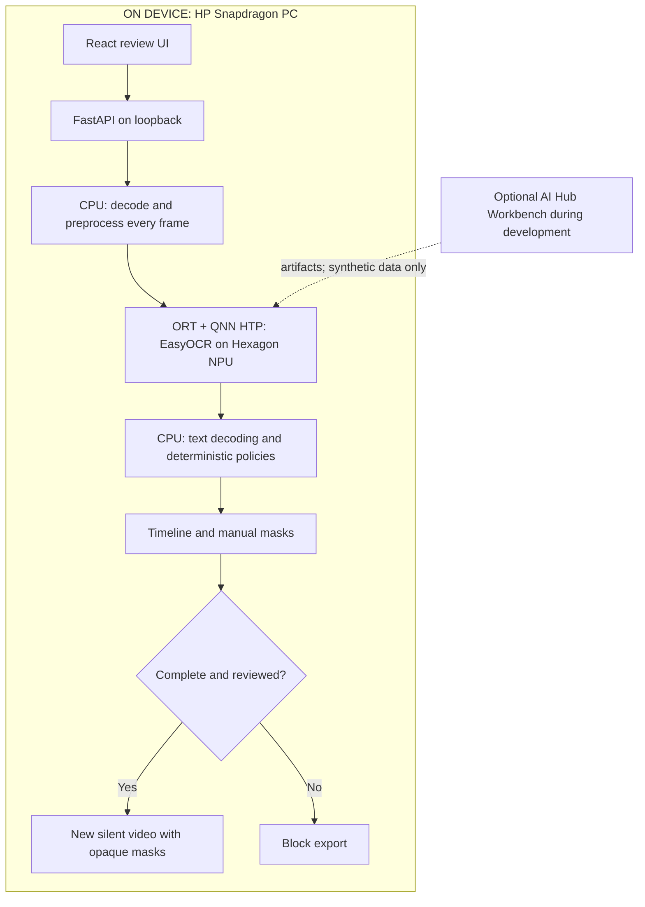

# FrameSeal

**Review every frame before you share.**

FrameSeal is a proposed offline application that finds selected sensitive text throughout short screen recordings, lets the author review redactions, and exports a processed copy without uploading the original. It is intended for optimization on **Snapdragon-powered HP Windows PCs**.

**Status: proposal and architecture complete; application implementation, CPU tests and Snapdragon hardware validation are pending.** No working demo or benchmark is claimed. Prepared for the Snapdragon AI Lab Build & Present Challenge 2026 by Akash (@akashrana1001).

## Problem and workflow

Developers and QA engineers record browser, terminal and dashboard workflows. An email or private identifier can appear briefly during a window switch. Manually checking the entire recording is tedious, while cloud processing receives the sensitive original.

1. Import a supported short recording and choose email/exact-string rules.
2. Analyze every decoded frame with local OCR.
3. Review findings on a timeline and adjust masks manually.
4. Export a new video with opaque masks and no audio.

Incomplete processing blocks export. **Processing every frame does not guarantee detection of every secret.** Human review remains part of the product.

## Why Snapdragon

Repeated text detection and recognition are the NPU workloads. The planned route is Qualcomm EasyOCR ONNX assets through ONNX Runtime QNN and QAIRT HTP to the Hexagon NPU. CPU code handles decoding, preprocessing, deterministic rules and encoding.

Qualcomm publishes a [Windows-on-Snapdragon EasyOCR example](https://github.com/qualcomm/Startup-Demos/blob/main/CV_VR/AI_PC/EasyOCR/README.md) and [model assets with device profiles](https://huggingface.co/qualcomm/EasyOCR). These establish a credible route, not FrameSeal performance. CPU processing provides the same privacy property; reduced latency and CPU contention from NPU offload remain to be measured on the target HP device.

## Architecture

## MVP boundaries

English text, 720p recordings up to 30 seconds, email/exact-string rules, every-frame analysis, manual masks, silent export and offline operation after setup. The first supported codec/frame-rate profile will be pinned during the video spike. Live meeting filters, LLMs, automatic sharing and universal PII guarantees are excluded.

## Documents

| File | Purpose |
|---|---|
| [Requirements](docs/REQUIREMENTS.md) | Core workflow and acceptance criteria |
| [Architecture](docs/ARCHITECTURE.md) | Components, privacy and data flow |
| [Tech stack](docs/TECH_STACK.md) | Dependencies and deployment environments |
| [Model plan](docs/MODEL_PLAN.md) | Exact model family and validation gates |
| [Tasks](docs/TASKS.md) | Small verifiable implementation stages |
| [Demo plan](docs/DEMO_PLAN.md) | Proposed judge walkthrough |
| [Evaluation](docs/EVALUATION.md) | Reproducible quality and performance tests |
| [Sources](docs/SOURCES.md) | Technical evidence and prior work |
| [Submission materials](submission/README.md) | Description PDF and pitch PDF/PPTX |
| [Third-party notices](THIRD_PARTY_NOTICES.md) | Licensing and attribution boundaries |

## Implementation and evidence

There are no installation commands yet because the app has not been implemented. Development starts with a CPU OCR spike, then video processing, review UI and actual Snapdragon deployment. Every stage follows BUILD → RUN → TEST → VERIFY → COMMIT → NEXT.

| Evidence | Current status |
|---|---|
| CPU OCR accuracy | Not measured |
| End-to-end video export | Not implemented |
| QNN execution on HP hardware | Not tested |
| Offline workflow | Not tested |
| CPU/NPU speed and power | Not measured |

No private recordings, model weights or actual credentials are included. This is not an official Qualcomm or HP product and implies no endorsement.
