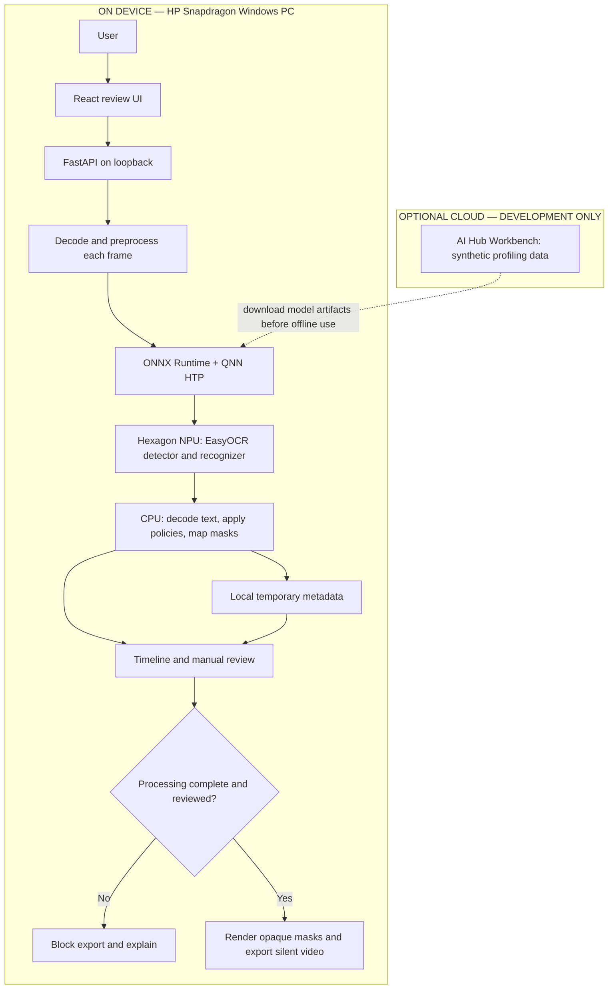

# Architecture

Status: design, not deployed software.

Use React, FastAPI, Python, ONNX Runtime and a local video decoder/encoder. No MongoDB, Redis, BullMQ, LangChain, cloud backend, accounts or hosted telemetry. A sequential worker plus a bounded queue is sufficient. Serve frontend assets locally; bind API to loopback with a random session token, Origin checks and explicit file selection. Initial deployment can be a documented launcher; native installer and ARM64 packaging come after inference works.

Store mask positions, timestamps, rule labels and processing status. Avoid persistent OCR transcripts and plaintext private-string logs. Keep originals in the user's selected location; temporary files need cleanup. Do not promise forensic secure deletion on SSDs. Strip audio in the first version because visual redaction does not remove spoken secrets. Accessibility: keyboard navigation, labelled controls, visible focus, large preview, high-contrast masks and text status beyond colour alone.

## Job state and export integrity

States: selected, validating, analyzing, awaiting-review, exporting, completed, failed, cancelled. Store frame index, presentation timestamp, processing status, model identity, mask coordinates/ranges and rule labels. Avoid raw private-string values in logs.

Export requires a complete analysis ledger and explicit user review. Re-decoding must match the analyzed frame sequence. Write to a temporary output, validate its streams and timing, then expose the completed copy. A mismatch fails export. Never substitute the original footage.
